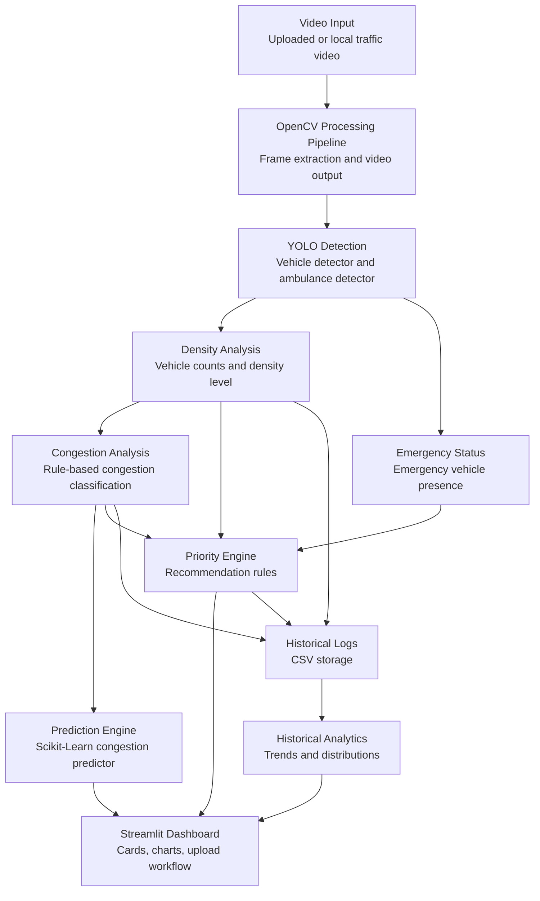
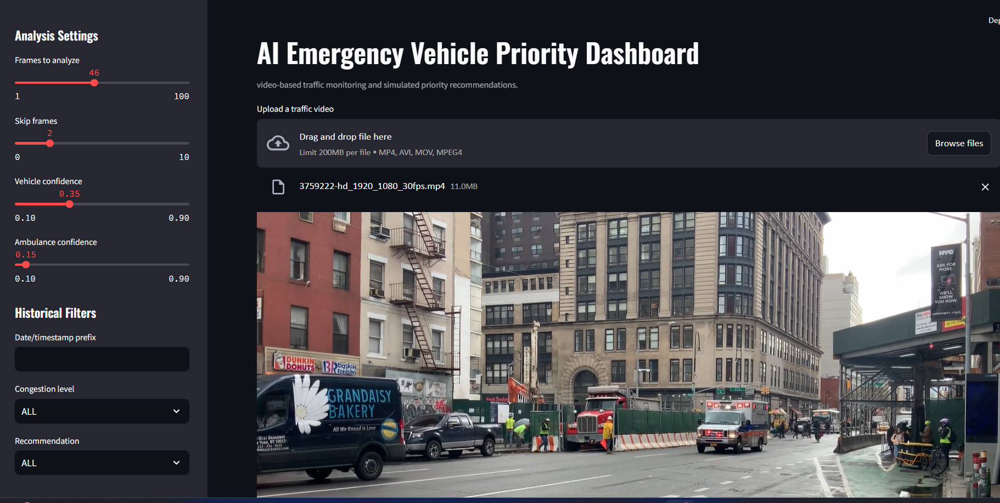
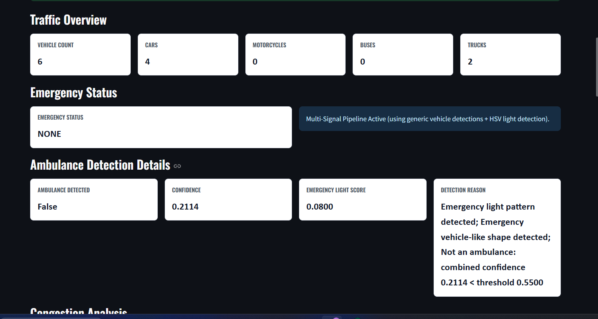
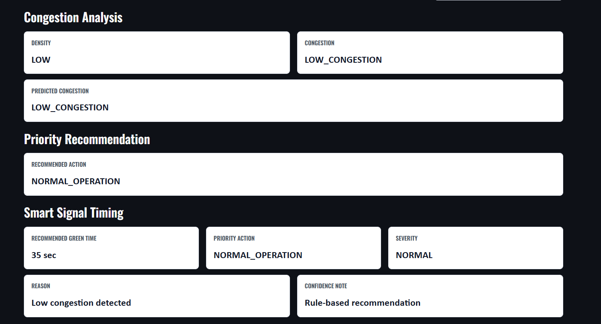
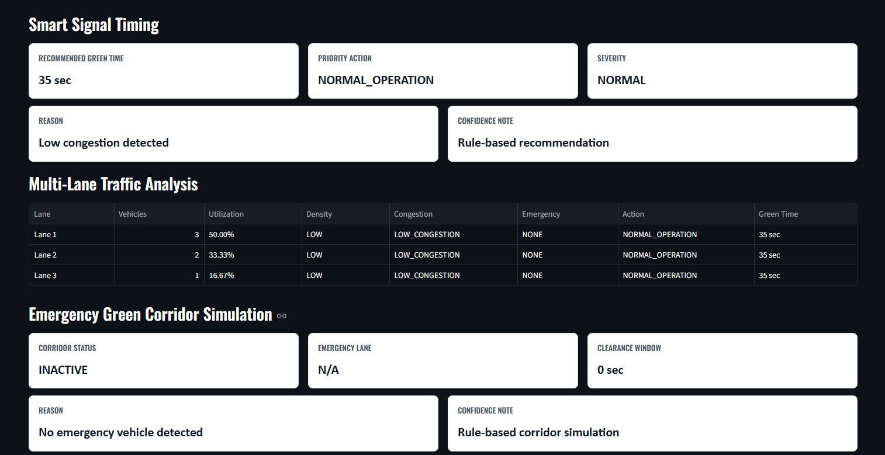
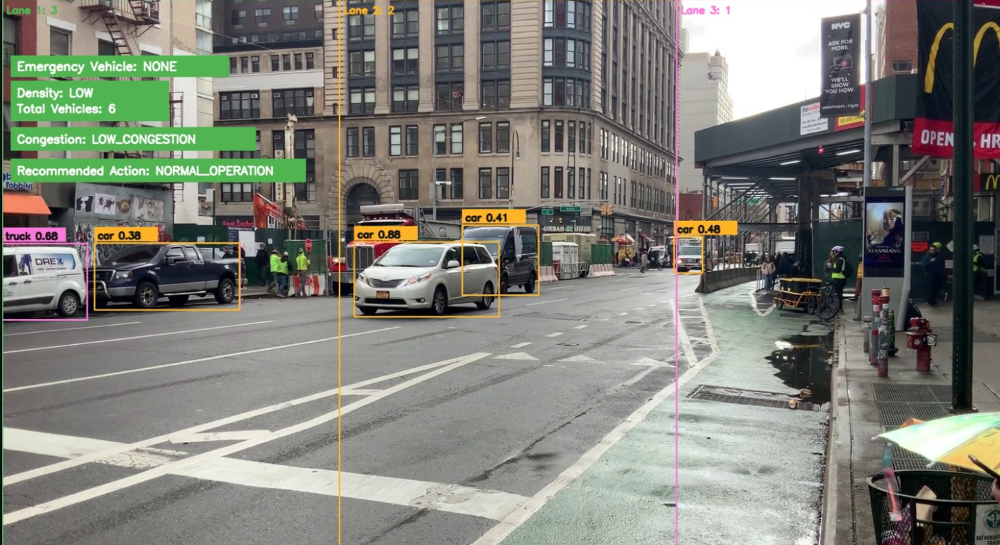
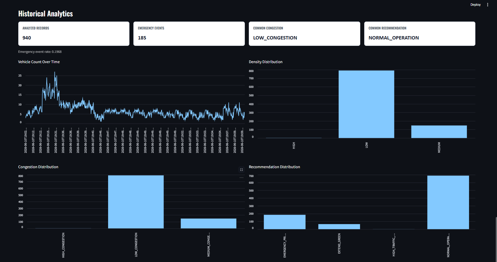

# TrafficIQ: AI-Powered Intelligent Traffic Management System


TrafficIQ is an AI-powered intelligent traffic management system that analyzes traffic videos, detects vehicles and emergency vehicles, estimates traffic density, classifies congestion, predicts congestion levels, and recommends simulated emergency priority actions through an interactive Streamlit dashboard.

This project is a software simulation and analytics platform. It does not control real traffic lights, emergency infrastructure, IoT hardware, GPS systems, or siren/audio devices.

## Quick Start

```powershell
python -m venv .venv
.\.venv\Scripts\Activate.ps1
python -m pip install --upgrade pip
pip install -r requirements.txt
streamlit run frontend/app.py
```

## Why This Project

Emergency vehicles often lose critical time when traffic is dense, intersections are unmanaged, or operators lack timely visibility into congestion patterns. Even a short delay can matter when ambulances, fire vehicles, or emergency response units need a clear route.

This platform demonstrates how computer vision and traffic analytics can support smarter emergency-priority decisions in a controlled software environment. Uploaded traffic videos are converted into structured insights: vehicle counts, density levels, congestion categories, emergency vehicle status, historical trends, and a recommended priority action.

The project is intentionally scoped for portfolio and learning use. It focuses on the AI, analytics, and dashboard layers that would support a future intelligent traffic system, without claiming real-world signal control or safety-critical deployment readiness.


## Key Features

| Feature | Description | Status |
| --- | --- | --- |
| Vehicle Detection | Detects cars, motorcycles, buses, and trucks using YOLOv8n. | Complete |
| Emergency Vehicle Detection | Provides modular ambulance detection infrastructure for custom trained weights. | Complete |
| Traffic Density Analysis | Calculates per-frame vehicle counts and LOW, MEDIUM, HIGH density levels. | Complete |
| Congestion Classification | Maps density outputs to congestion classes. | Complete |
| Congestion Prediction | Uses Scikit-Learn to train and run congestion predictions from generated datasets. | Complete |
| Historical Analytics | Summarizes vehicle trends, emergency events, congestion distribution, and recommendation frequency. | Complete |
| Emergency Priority Recommendation | Produces simulated priority actions using emergency, density, and congestion inputs. | Complete |
| Streamlit Dashboard | Provides upload, analysis, status cards, prediction display, and historical analytics views. | Complete |

## Technical Highlights

- **YOLOv8 Computer Vision**: Baseline detection uses YOLOv8n for CPU-friendly vehicle detection.
- **OpenCV Processing Pipeline**: Video loading, frame extraction, annotation, FPS reporting, and output video writing.
- **Scikit-Learn Prediction Module**: Trainable congestion predictor with model persistence and evaluation metrics.
- **Streamlit Analytics Dashboard**: Upload-based interface for demos, screenshots, and project presentation.
- **Modular Analytics Engine**: Separate density, congestion, priority, historical analytics, and prediction modules.
- **Automated Testing Suite**: Pytest coverage for core analytics, prediction, detection helpers, and pipeline behavior.

## Engineering Achievements

- 86 automated tests passing
- Modular architecture across detection, analytics, prediction, and frontend layers
- End-to-end analytics pipeline from video input to dashboard insight
- Congestion prediction pipeline with dataset generation and saved model support
- Historical analytics for trends, distributions, and event statistics
- Production-ready logging patterns and graceful handling for missing logs or models

## System Architecture



## Workflow

```text
Video input
  -> OpenCV frame processing
  -> YOLO vehicle and emergency detection
  -> Traffic density analysis
  -> Congestion classification
  -> Congestion prediction
  -> Emergency priority recommendation
  -> Streamlit dashboard and historical analytics
```

## Technology Stack

| Layer | Technology | Purpose |
| --- | --- | --- |
| Language | Python | Core implementation |
| Computer Vision | YOLOv8n, Ultralytics | Vehicle detection baseline |
| Video Processing | OpenCV | Video loading, frame processing, annotation, output writing |
| Analytics | Pandas, NumPy | CSV logs, counts, summaries, transformations |
| Machine Learning | Scikit-Learn | Congestion prediction model |
| Dashboard | Streamlit | Interactive upload and analytics interface |
| Visualization | Streamlit charts, Plotly-compatible data outputs | Dashboard trends and distributions |
| Storage | CSV files | Initial historical storage and training data generation |
| Testing | Pytest | Automated validation |

## Feature Matrix

| Module | Input | Output | Reusable API |
| --- | --- | --- | --- |
| `ml/cv_pipeline.py` | Video file | Annotated video, frames, FPS metadata | Video processing helpers |
| `ml/detectors/vehicle_detector.py` | Frame or video | Vehicle boxes, confidence scores, CSV logs | `detect_vehicles(frame)` |
| `ml/detectors/ambulance_detector.py` | Frame or video | Ambulance detections, emergency status | `detect_ambulances(frame)`, `is_emergency_present(...)` |
| `ml/analytics/density_analyzer.py` | Vehicle counts | Density result and density logs | `analyze_density(...)` |
| `ml/analytics/congestion_classifier.py` | Density result | Congestion result and congestion logs | `classify_congestion(...)` |
| `ml/analytics/priority_engine.py` | Emergency, density, congestion | Recommended priority action | `generate_priority_action(...)` |
| `ml/prediction/dataset_builder.py` | Historical logs | Training-ready CSV dataset | Dataset build helpers |
| `ml/prediction/congestion_predictor.py` | Training dataset or feature row | Model, metrics, prediction | `train_model(...)`, `load_model(...)`, `predict_congestion(...)` |
| `ml/analytics/history_analytics.py` | Historical logs | Trends, distributions, summary metrics | `generate_summary(...)`, `generate_trend_data(...)`, `generate_event_statistics(...)` |
| `frontend/app.py` | Uploaded video and logs | Dashboard cards, charts, analysis output | Streamlit app |

## Dashboard Preview

The project includes a Streamlit dashboard for GitHub screenshots, resume demos, and project presentations.

Suggested screenshot gallery:

### Video Upload And Dashboard Home



### Traffic Overview And Ambulance Detection



### Congestion And Smart Signal Timing



### Multi-Lane And Green Corridor Analysis



### Annotated Detection Output



### Historical Analytics




Dashboard sections:

- Traffic Overview
- Emergency Status
- Congestion Analysis
- Priority Recommendation
- Historical Analytics

Status cards:

- Vehicle Count
- Density
- Congestion
- Emergency Status
- Recommended Action
- Predicted Congestion

## Project Structure

```text
TrafficIQ/
├── .github/
│   └── workflows/
│       └── .gitkeep
├── backend/
│   └── .gitkeep
├── data/
│   ├── datasets/
│   │   └── .gitkeep
│   ├── logs/
│   │   └── .gitkeep
│   ├── models/
│   │   └── .gitkeep
│   ├── processed/
│   │   └── .gitkeep
│   └── raw/
│       └── .gitkeep
├── docs/
│   ├── screenshots/
│   │   └── .gitkeep
│   └── .gitkeep
├── frontend/
│   ├── .gitkeep
│   └── app.py
├── ml/
│   ├── __init__.py
│   ├── .gitkeep
│   ├── cv_pipeline.py
│   ├── analytics/
│   │   ├── __init__.py
│   │   ├── congestion_classifier.py
│   │   ├── density_analyzer.py
│   │   ├── history_analytics.py
│   │   └── priority_engine.py
│   ├── detectors/
│   │   ├── __init__.py
│   │   ├── ambulance_detector.py
│   │   └── vehicle_detector.py
│   └── prediction/
│       ├── __init__.py
│       ├── congestion_predictor.py
│       └── dataset_builder.py
├── tests/
│   ├── conftest.py
│   ├── test_congestion_classifier.py
│   ├── test_congestion_predictor.py
│   ├── test_cv_pipeline.py
│   ├── test_dataset_builder.py
│   ├── test_density_analyzer.py
│   ├── test_detectors.py
│   ├── test_history_analytics.py
│   └── test_priority_engine.py
├── .gitignore
├── PRD.md
├── PROJECT_SETUP.md
├── README.md
├── phase12_execution_plan.md
└── requirements.txt
```

## Installation

Create and activate a virtual environment:

```powershell
python -m venv .venv
.\.venv\Scripts\Activate.ps1
```

If PowerShell blocks activation:

```powershell
Set-ExecutionPolicy -ExecutionPolicy RemoteSigned -Scope CurrentUser
```

Install dependencies:

```powershell
python -m pip install --upgrade pip
pip install -r requirements.txt
```

Verify the environment:

```powershell
python --version
pip list
```

## Running The Dashboard

```powershell
streamlit run frontend/app.py
```

Accepted upload formats:

```text
mp4
avi
mov
```

The dashboard analyzes a configurable frame sample for demo performance. Historical dataset generation remains separate from Streamlit and can use available CSV logs.

## Core CLI Workflows

Run the OpenCV pipeline:

```powershell
python ml/cv_pipeline.py --input data/raw/sample_traffic.mp4 --output data/processed/annotated_output.mp4 --max-frames 100
```

Run vehicle detection:

```powershell
python ml/detectors/vehicle_detector.py --input data/raw/sample_traffic.mp4 --output data/processed/vehicle_detection_output.mp4 --log data/logs/vehicle_detections.csv --max-frames 100
```

Run combined vehicle and ambulance detection:

```powershell
python ml/detectors/ambulance_detector.py --input data/raw/sample_traffic.mp4 --output data/processed/emergency_detection_output.mp4 --log data/logs/emergency_detections.csv --max-frames 100
```

Generate density logs:

```powershell
python ml/analytics/density_analyzer.py --detections-log data/logs/vehicle_detections.csv --output-log data/logs/density_analysis.csv
```

Generate congestion logs:

```powershell
python ml/analytics/congestion_classifier.py --density-log data/logs/density_analysis.csv --output-log data/logs/congestion_analysis.csv
```

Generate priority recommendations:

```powershell
python ml/analytics/priority_engine.py --congestion-log data/logs/congestion_analysis.csv --output-log data/logs/priority_actions.csv
```

Build a training dataset:

```powershell
python ml/prediction/dataset_builder.py --logs data/logs --output data/datasets/congestion_training_dataset.csv
```

Train the congestion predictor:

```powershell
python ml/prediction/congestion_predictor.py --train data/datasets/congestion_training_dataset.csv
```

Run a CLI prediction:

```powershell
python ml/prediction/congestion_predictor.py --predict --total-vehicles 18 --car-count 10 --motorcycle-count 4 --bus-count 2 --truck-count 2 --density MEDIUM
```

Generate historical analytics:

```powershell
python ml/analytics/history_analytics.py --logs data/logs
```

## Data And Logs

CSV storage is used for initial development and portfolio demonstration.

Common output locations:

```text
data/logs/vehicle_detections.csv
data/logs/emergency_detections.csv
data/logs/density_analysis.csv
data/logs/congestion_analysis.csv
data/logs/priority_actions.csv
data/datasets/congestion_training_dataset.csv
data/models/congestion_predictor.pkl
```

## ML Model Explanation

The congestion prediction module uses Scikit-Learn and trains from generated historical datasets.

Training features:

```text
total_vehicles
car_count
motorcycle_count
bus_count
truck_count
density
emergency_present
```

Target variable:

```text
congestion
```

Evaluation metrics:

```text
accuracy
precision
recall
F1 score
```

Metrics should be interpreted only for the available dataset. They are not real-world traffic benchmarks.

## Testing

Run the automated test suite:

```powershell
pytest
```

Current validated project result:

```text
56 tests passing
```

Covered areas include:

- Density analysis
- Congestion classification
- Emergency priority engine
- Dataset generation
- Congestion prediction
- Detector helper behavior
- CV pipeline helpers
- Historical analytics

## Deployment

Current deployment target:

```powershell
streamlit run frontend/app.py
```

This supports local Streamlit deployment for demos, screenshots, and project presentations.

Future deployment target:

- Render-hosted Streamlit app

Deployment is currently local only. No Render deployment, FastAPI backend, or production traffic infrastructure has been implemented.

## CI/CD Preparation

The repository prepares the following structure for future automation:

```text
.github/workflows/
```

No workflow YAML files are included yet. Future CI/CD support can add pytest validation, import checks, and dashboard startup checks after approval.

## Limitations

- Ambulance detection requires custom trained ambulance data and model weights for meaningful accuracy.
- The baseline detector uses YOLOv8n for CPU-friendly demonstration, not maximum detection performance.
- The prediction model is trained on limited generated or historical CSV data.
- The priority engine is rule-based and recommends simulated actions only.
- The project assumes a single-intersection or single-video analysis context.
- The dashboard samples frames for responsiveness during demos.
- CSV storage is suitable for early development but not large-scale production analytics.
- The project does not control real traffic lights or emergency infrastructure.
- No GPS, IoT, siren/audio detection, or hardware integration is included.

## Future Roadmap

Version 2 roadmap:

| Phase | Roadmap Item | Description |
| --- | --- | --- |
| Phase 17 | FastAPI Backend | Add an API layer for serving analytics and model predictions. |
| Phase 18 | ML Signal Recommendation Engine | Replace rule-only recommendations with trained decision support models. |
| Phase 19 | Advanced Dashboard | Add richer visualizations, scenario comparisons, and portfolio polish. |

These roadmap items are not implemented in the current repository.

## Project Status
Current status:

- Documentation and portfolio presentation upgraded
- Streamlit-first architecture
- No FastAPI backend yet
- CSV-first storage
- CPU-only target
- YOLOv8n baseline detector
- 96 automated tests passing
